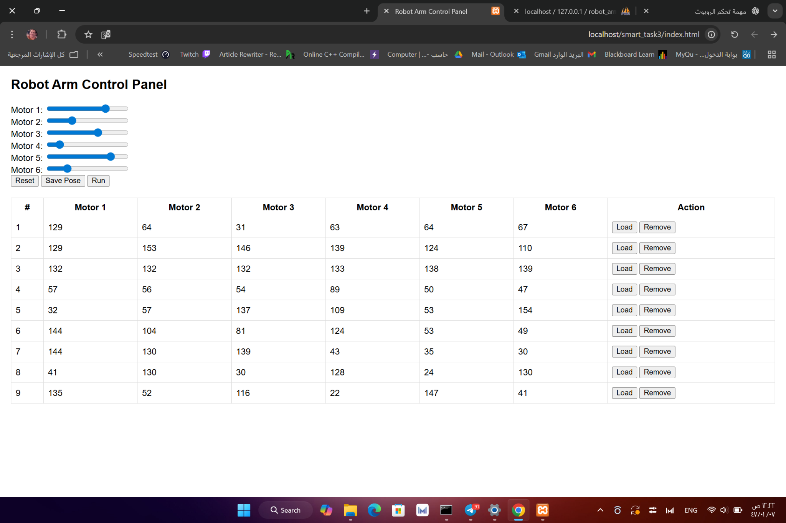

# Robot Arm Control Panel

This project is a simple web-based interface to control a robot arm using sliders. It allows the user to save, load, and run predefined motor positions, which are stored in a MySQL database.

---

## 💡 Features

- Web interface to control 6 motors.
- Save and load poses from a database.
- Update status flag in the database.
- Reset motor values to default.
- Clean and simple UI using HTML, CSS, JavaScript, and PHP.

---

## 🔧 Technologies Used

- HTML, CSS, JavaScript (Frontend)
- PHP (Backend)
- MySQL with phpMyAdmin (Database)
- XAMPP (Local development server)

---

## 🗂 Project Structure

```
robot-arm-control/
├── index.html             # Main user interface
├── style.css              # UI styling
├── script.js              # JavaScript for dynamic control
├── db.php                 # Database connection file
├── get_run_pose.php       # Insert, retrieve and delete poses
├── update_status.php      # Update status to 0
└── poses.sql              # SQL script to create the database table
```

---

## 🛠️ Setup Instructions

1. **Install XAMPP** and start **Apache** and **MySQL**.

2. **Create Database**:
   - Open `http://localhost/phpmyadmin`
   - Create a new database named `robot_arm`
   - Import `poses.sql` file to create the required table.

3. **Place Project Files**:
   - Copy all project files to: `C:\xampp\htdocs\robot-arm-control`

4. **Access the Interface**:
   - Open: `http://localhost/robot-arm-control/index.html`

---

## 📁 Database Table (poses)

| Column   | Type     | Description               |
|----------|----------|---------------------------|
| id       | INT      | Auto increment ID         |
| motor1   | INT      | Motor 1 position          |
| motor2   | INT      | Motor 2 position          |
| motor3   | INT      | Motor 3 position          |
| motor4   | INT      | Motor 4 position          |
| motor5   | INT      | Motor 5 position          |
| motor6   | INT      | Motor 6 position          |
| status   | INT      | Status flag (default = 0) |

---

## 📷 Screenshot



---

## 📌 Notes

- This project is developed for training purposes at **Smart Methods**.
- You can expand it to integrate with real motors using Arduino or ESP32.

---

## 📤 Author

**Waleed Alharbi**  
Student at Qassim University  
ID: 431108129
