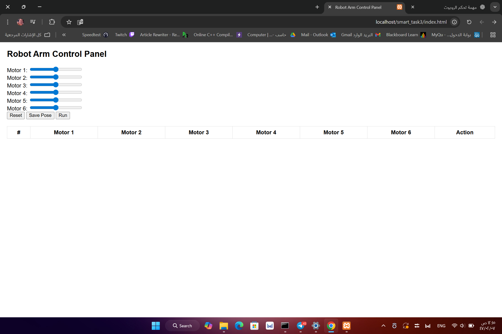
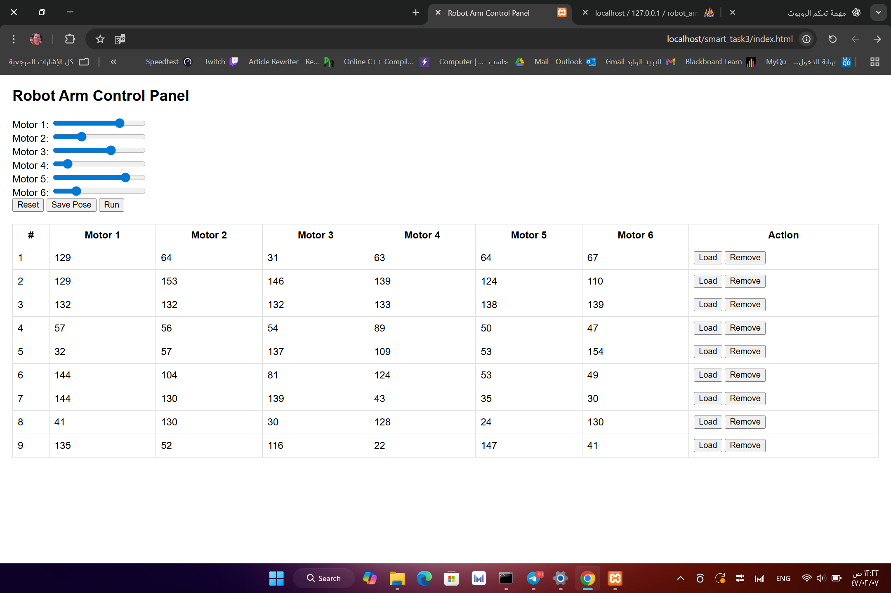
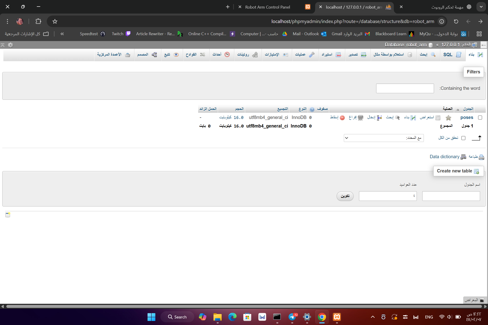
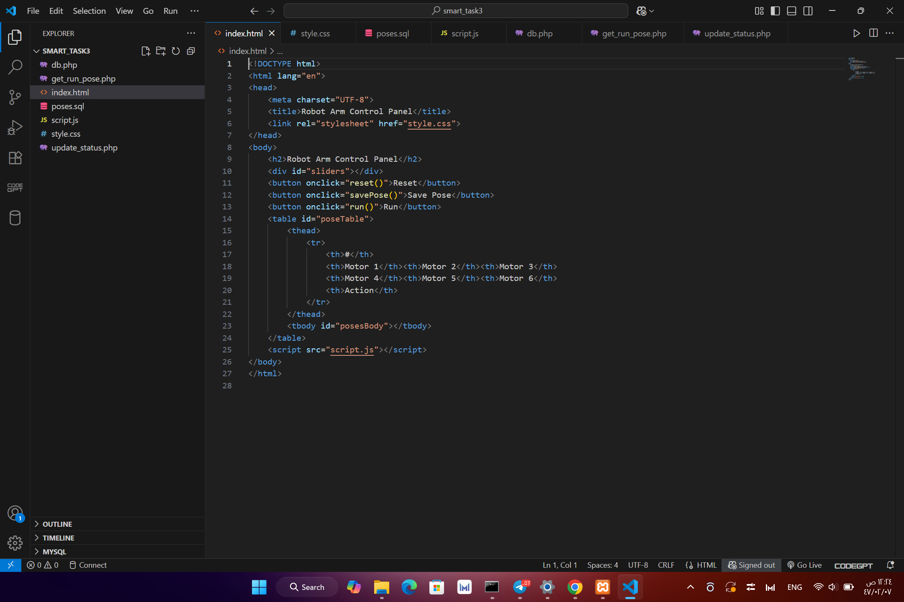

# Robot Arm Control Panel

A simple web-based control panel for a robot arm using HTML, CSS, JavaScript, PHP, and MySQL.  
The system allows users to control six motors, save motor poses, load saved poses, remove poses, and run the selected pose.

---

## Project Preview

### Main Interface

<p align="center">
  
</p>

The main interface provides six sliders, each representing one motor of the robot arm.

---

### Saved Poses

<p align="center">
  
</p>

Saved motor positions are displayed in a table. Each saved pose can be loaded or removed.

---

### Database Preview

<p align="center">
  
</p>

The saved poses are stored in a MySQL database using phpMyAdmin.

---

### Code Preview

<p align="center">
  
</p>

The project was developed using HTML, CSS, JavaScript, PHP, and MySQL.

---

## Features

- Control 6 robot arm motors using sliders
- Save motor positions as poses
- Load saved poses
- Remove saved poses
- Reset motor values
- Store poses in MySQL database
- Simple web-based interface

---

## Technologies Used

- HTML
- CSS
- JavaScript
- PHP
- MySQL
- XAMPP
- phpMyAdmin

---

## Project Structure

```text
robot-arm-control/
├── index.html
├── style.css
├── script.js
├── db.php
├── get_run_pose.php
├── update_status.php
├── poses.sql
└── screenshots/
```

---

## Setup and Run Locally

### Requirements

- XAMPP or any local PHP server
- MySQL
- Modern web browser

### Steps

1. Start Apache and MySQL from XAMPP.

2. Open phpMyAdmin:

```text
http://localhost/phpmyadmin
```

3. Create a database named:

```text
robot_arm
```

4. Import the SQL file:

```text
poses.sql
```

5. Move the project folder into:

```text
C:\xampp\htdocs\
```

6. Open the project in your browser:

```text
http://localhost/smart_task3/
```

---

## Important Note

This project was developed for training and learning purposes in a local environment.  
It is not intended for production use without additional security, validation, and deployment improvements.

---

## Future Improvements

- Improve the user interface design
- Add authentication
- Add input validation
- Connect with real robot arm hardware
- Add real-time robot status feedback
- Improve database security

---

## Author

Waleed Alharbi
